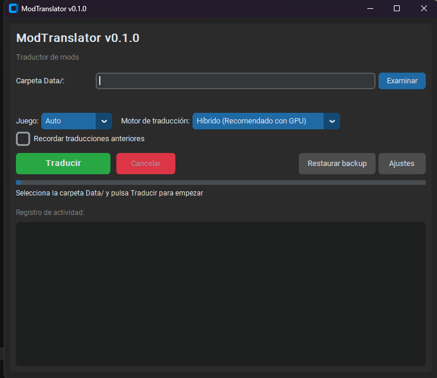

# modtranslator

**Traductor automático offline de mods para juegos Bethesda.**

Traduce archivos ESP/ESM, scripts PEX y archivos MCM de forma completamente offline usando modelos de traducción neuronal. Compatible con Fallout 3, Fallout: New Vegas y Skyrim (SE/AE).

> **Probado con los 3 juegos soportados.** Fallout 3 (124 archivos, ~97K strings), Fallout: New Vegas (244 archivos, ~142K strings) y Skyrim SE/AE (542 archivos, ~128K strings + 2.302 scripts PEX + MCM) — todos funcionan correctamente con los mods traducidos.

## Por qué

Miles de mods en Nexus están solo en inglés. Las herramientas existentes como xTranslator requieren trabajo manual string por string, o importar traducciones hechas por otros que muchas veces no existen. No había ninguna solución para traducir mods de forma masiva y offline.

Yo quería jugar con mods sin tener la mitad de los textos en español y la otra mitad en inglés. Así que construí una.

## Tech Stack

| Capa | Tecnologías |
|------|-------------|
| **Core** | Python, parseo binario (struct), zlib |
| **ML/NLP** | CTranslate2, Helsinki-NLP Opus-MT, Meta NLLB-200, SentencePiece |
| **Backend** | SQLite (cache), TOML (glosarios), DeepL API |
| **GUI** | CustomTkinter, threading |
| **CLI** | Typer |
| **Build** | PyInstaller, Hatchling |
| **Testing** | pytest (~84% cobertura), ruff, mypy strict |
| **GPU** | NVIDIA CUDA (opcional) |

## Resultados

| Juego | Archivos | Strings | Errores | Juego funcional |
|-------|----------|---------|---------|-----------------|
| Fallout 3 | 124 ESP/ESM | ~97K | 0 | Sí |
| Fallout: New Vegas | 244 ESP/ESM | ~142K | 0 | Sí |
| Skyrim SE/AE | 542 ESP/ESM + 2.302 PEX + MCM | ~128K | 0 | Sí |

## Características

- **Traducción in-place** — traduce directamente sobre la carpeta Data/ del juego
- **Backup automático** — respalda solo los archivos que se van a modificar antes de traducir
- **Restaurar backup** — un click para volver a los archivos originales
- **GUI incluida** — interfaz gráfica con CustomTkinter, sin necesidad de terminal
- **CLI completa** — para usuarios avanzados y automatización
- **3 tipos de archivo** — ESP/ESM (plugins), PEX (scripts de Papyrus), MCM (menús de configuración)
- **5 backends de traducción** — desde modelos offline hasta APIs cloud
- **Cache de traducciones** — no retraduce strings ya procesados
- **Glosarios por juego** — protege terminología oficial (Refugio, Estimulante, Sanguinario...)

## GUI

La interfaz gráfica permite traducir mods sin usar la terminal:

1. Selecciona la carpeta `Data/` del juego
2. Elige el motor de traducción
3. Pulsa **Traducir**

La GUI hace backup automático de los archivos que va a modificar. Si algo sale mal, pulsa **Restaurar backup** para volver a los originales.



### Ejecutable (Windows)

Descarga el ZIP de la sección Releases — no necesita Python ni dependencias.

### Desde código

```bash
pip install -e ".[opus-mt,nllb]"
python modtranslator_gui.py
```

## Instalación (CLI)

```bash
git clone https://github.com/adamzgz/modtranslator.git
cd modtranslator

# Instalación base (CLI + DeepL)
pip install -e .

# Traducción offline — recomendado
pip install -e ".[opus-mt,nllb]"

# Desarrollo (tests, lint, type checking)
pip install -e ".[dev]"
```

### Aceleración GPU (Opcional)

```bash
pip install torch nvidia-cublas-cu12
# Usar --device cuda o --device auto
```

## Uso rápido (CLI)

```bash
# Escanear un mod para ver strings traducibles
modtranslator scan MyMod.esp

# Traducir un archivo
modtranslator translate MyMod.esp --backend hybrid --device cuda

# Traducir toda una carpeta de juego
modtranslator batch "C:\Games\Fallout 3\Data" --backend hybrid --device cuda --game fo3

# Traducir scripts PEX de Skyrim
modtranslator batch-pex "C:\Games\Skyrim\Data" --backend opus-mt

# Traducir archivos MCM de Skyrim
modtranslator batch-mcm "C:\Games\Skyrim\Data" --backend opus-mt
```

## Backends de Traducción

| Backend | Velocidad (GPU) | Coste | Calidad EN→ES | Offline |
|---------|-----------------|-------|---------------|---------|
| **Híbrido (tc-big+NLLB)** | ~33 str/s | Gratis | Mejor combinada | Sí |
| **Opus-MT tc-big** | 241–468 str/s | Gratis | Muy buena | Sí |
| Opus-MT base | 188–291 str/s | Gratis | Buena | Sí |
| NLLB 1.3B | 32–71 str/s | Gratis | Excelente (texto largo) | Sí |
| DeepL | Online | API key | Muy buena | No |

El backend **híbrido** enruta strings cortos (1–3 palabras) a Opus-MT tc-big y strings largos (4+ palabras) a NLLB 1.3B — combinando la velocidad de tc-big con la fluidez de NLLB en oraciones complejas.

## Cómo Funciona

### Fallout 3 / Fallout: New Vegas (strings inline, cp1252)

```
Archivo ESP/ESM (binario, codificación Windows-1252)
    │
    ▼
1. PARSEAR ────────── Lector binario → Árbol Record/Group (formato TES4)
    │                  Gestiona records comprimidos (zlib), cabeceras de 24 bytes
    ▼
2. EXTRAER ────────── El registro filtra subrecords traducibles
    │                  FULL (37 tipos), DESC, NAM1, RNAM, TNAM, NNAM, ITXT, CNAM
    ▼
3. DETECTAR IDIOMA ── Heurística de 4 capas para saltar strings ya traducidos
    │                  glosario → langid → diccionario español → diccionario inglés
    ▼
4. PROTEGER ───────── Términos del glosario → placeholders Gx0, Gx1
    │                  Palabras españolas en strings mixtos → placeholders Cx0, Cx1
    ▼
5. TRADUCIR ───────── El backend procesa strings en lotes
    │                  Cache SQLite para saltar strings ya traducidos
    ▼
6. RESTAURAR ──────── Placeholders → términos originales protegidos
    │
    ▼
7. ESCRIBIR ───────── Serializar árbol con tamaños recalculados → ESP/ESM válido
```

### Skyrim SE/AE (string tables externas, UTF-8)

Skyrim usa un sistema completamente diferente: los plugins **localizados** (flag `0x80` en la cabecera) no almacenan texto inline, sino **StringIDs** (uint32) que apuntan a string tables externas.

```
Plugin ESP/ESM + String tables ({Plugin}_English.STRINGS/.DLSTRINGS/.ILSTRINGS)
    │
    ▼
1. DETECTAR ───────── Leer flag LOCALIZED (0x80) en cabecera del plugin
    │                  Si está activo → flujo de string tables
    ▼
2. CARGAR TABLAS ──── Parsear las 3 tablas: .STRINGS, .DLSTRINGS, .ILSTRINGS
    │                  Formato: [count:u32][data_size:u32] + directorio [id:u32][offset:u32]
    │                  Fusionar en un solo diccionario {StringID → texto} (IDs únicos entre tablas)
    ▼
3. EXTRAER ────────── Recorrer árbol de records, resolver StringIDs → texto original
    │                  Mismos subrecords traducibles que FO3/FNV (FULL, DESC, etc.)
    ▼
4. TRADUCIR ───────── Mismo pipeline: detectar idioma → proteger → traducir → restaurar
    │
    ▼
5. ESCRIBIR TABLAS ── Generar nuevas string tables con textos traducidos
    │                  Recalcular offsets y data_size para cada tabla
    │                  Guardar como {Plugin}_Spanish.STRINGS/.DLSTRINGS/.ILSTRINGS
```

Las string tables usan UTF-8 (no cp1252). `.STRINGS` almacena texto null-terminated; `.DLSTRINGS` e `.ILSTRINGS` usan formato length-prefixed (`[length:u32 incl null] + texto + null`).

### Scripts PEX (Papyrus compilado)

```
Archivo .pex (big-endian, magic 0xFA57C0DE)
    │
    ▼
1. PARSEAR ────────── Leer string table: [count:u16] + [len:u16 + chars]×N
    │                  Cada string tiene un tipo: 0x01 (identificador) o 0x02 (literal)
    ▼
2. FILTRAR ────────── Solo traducir strings con tipo puro 0x02 (literales de texto)
    │                  NUNCA tocar 0x01 (nombres de funciones, variables, propiedades)
    │                  Filtros adicionales: rutas de archivo, nombres de eventos, etc.
    ▼
3. TRADUCIR ───────── Mismo pipeline de traducción que ESP/ESM
    │
    ▼
4. ESCRIBIR ───────── Reescribir string table con longitudes actualizadas
                       Mantener el resto del archivo intacto byte a byte
```

### Archivos MCM (menús de configuración)

```
Archivo de traducción MCM (UTF-16-LE con BOM, tab-separated)
    │                        Formato: $KEY\tValue (una entrada por línea)
    ▼
1. PARSEAR ────────── Leer como UTF-16-LE, separar clave ($KEY) y valor por tabulación
    │                  Solo traducir el valor, nunca la clave
    ▼
2. TRADUCIR ───────── Pipeline estándar sobre los valores
    │
    ▼
3. ESCRIBIR ───────── Reescribir manteniendo BOM, encoding UTF-16-LE y tabulaciones
```

### Pipeline Batch

El comando `batch` ejecuta tres fases secuenciales para traducir carpetas enteras:

```
Fase 1: PREPARAR — parsear, extraer, filtrar, proteger (por archivo)
Fase 2: TRADUCIR — deduplicar entre archivos, traducir strings únicos en chunks
Fase 3: ESCRIBIR — restaurar placeholders, parchear subrecords, guardar archivos
```

Las fases son secuenciales porque Fallout 3 determina el orden de carga de mods por timestamp de archivo — escrituras en paralelo darían timestamps idénticos y corromperían el orden de carga.

Para archivos de más de 150 MB (como Fallout3.esm con ~280 MB), se usa una estrategia de doble parseo: parsear → extraer → liberar plugin de memoria → traducir → re-parsear → parchear → escribir. Esto evita tener el árbol del plugin (~2 GB) y el modelo ML (~2 GB) en RAM a la vez.

## Decisiones Técnicas

- **Subrecords mutables**: `Subrecord.data` es `bytearray` — el patcher modifica in-place sin copias
- **Tamaños calculados**: `Subrecord.size` es una property (`len(self.data)`) — se actualiza automáticamente al mutar
- **Serialización bottom-up**: el writer recalcula todos los tamaños desde el árbol de records, así los strings traducidos de diferente longitud siempre producen archivos válidos
- **Placeholders compactos**: `Gx{i}` tokeniza como 3 tokens SentencePiece (vs 6+ con formatos más largos), logrando 100% de supervivencia a través de los pipelines de traducción neuronal
- **Cadena de encoding**: cp1252 → UTF-8 → latin-1 fallback para bytes edge-case (0x90, 0x8D, 0x9D)
- **String tables de Skyrim**: las 3 tablas (.STRINGS, .DLSTRINGS, .ILSTRINGS) se fusionan en un solo diccionario por StringID único — lookup O(1) durante el parcheo

## Glosarios por Juego

Glosarios TOML que protegen la terminología oficial de Bethesda:

```toml
[terms]
"Vault" = "Refugio"
"Stimpak" = "Estimulante"
"Brotherhood of Steel" = "Hermandad del Acero"
"Deathclaw" = "Sanguinario"
```

| Glosario | Alcance | Ejemplos |
|----------|---------|----------|
| `fallout_base_es.toml` | Compartido FO3/FNV | Stats SPECIAL, consumibles, facciones, armas |
| `fallout3_es.toml` | Capital Wasteland | Megaton, Three Dog, Talon Company |
| `falloutnv_es.toml` | Mojave Wasteland | NCR→RNC, Mr. House→Sr. House, Yes Man→Servibot |
| `skyrim_es.toml` | Skyrim | Dovahkiin, Whiterun→Carrera Blanca, Stormcloaks→Capas de la Tormenta |

## Arquitectura

```
src/modtranslator/
├── cli.py                  CLI con Typer, pipeline batch (3 fases secuenciales)
├── pipeline.py             Lógica compartida CLI/GUI
├── core/                   Parser/writer binario ESP/ESM + PEX
│   ├── parser.py             bytes → árbol de Records (formato TES4)
│   ├── writer.py             árbol de Records → bytes (recálculo bottom-up)
│   ├── records.py            Dataclasses: Subrecord, Record, GroupRecord, PluginFile
│   ├── string_table.py       String tables externas de Skyrim (.STRINGS/.DLSTRINGS/.ILSTRINGS)
│   ├── pex_parser.py         Parser de scripts PEX de Papyrus
│   └── plugin.py             Fachada: load_plugin / save_plugin
├── backends/               Backends de traducción (TranslationBackend ABC)
│   ├── opus_mt.py            Helsinki-NLP + CTranslate2 (base + tc-big)
│   ├── nllb.py               Meta NLLB-200 + CTranslate2 (600M/1.3B)
│   ├── hybrid.py             tc-big (corto) + NLLB (largo)
│   ├── deepl.py              API de DeepL
│   └── dummy.py              Backend de test: prefija [XX]
├── translation/            Extracción, filtrado y parcheo de strings
│   ├── extractor.py          árbol → list[TranslatableString]
│   ├── registry.py           (record_type, sub_type) → ¿traducible?
│   ├── glossary.py           Glosarios TOML + sistema de placeholders Gx{i}
│   ├── spanish_protect.py    Protección de palabras españolas con placeholders Cx{i}
│   ├── lang_detect.py        Heurística de detección de idioma (4 capas)
│   ├── patcher.py            Aplicar traducciones a bytearrays de subrecords
│   └── cache.py              Cache SQLite de traducciones (~/.modtranslator/)
├── gui/                    Interfaz gráfica con CustomTkinter
│   ├── app.py                Ventana principal, backup selectivo, traducción in-place
│   ├── worker.py             Worker en background thread
│   └── model_manager.py      Detección GPU y gestión de modelos
└── data/                   Diccionario español (~2.100 palabras)

glossaries/                 Archivos TOML de terminología por juego
tests/                      378 tests, ~84% cobertura
```

### Formato Binario TES4

El parser maneja el formato de plugins TES4 usado por los motores Gamebryo/Creation Engine:

- **Cabecera de Record**: `Type(4) + DataSize(4) + Flags(4) + FormID(4) + VCS1(4) + VCS2(4)` — 24 bytes
- **Subrecord**: `Type(4) + Size(2, uint16) + Data(N)`
- **Group (GRUP)**: cabecera de 24 bytes, `GroupSize` incluye la propia cabecera
- **Strings (FO3/FNV)**: null-terminated, codificación Windows-1252 (inline en subrecords)
- **Strings (Skyrim)**: flag `LOCALIZED` (`0x80`) en cabecera → strings almacenados en tablas externas UTF-8, subrecords contienen StringIDs (uint32) en vez de texto
- **Records comprimidos**: flag `0x00040000`, payload = `decompressed_size(4) + zlib`
- **Detección de juego**: float de versión en subrecord HEDR (0.94 = FO3/FNV, 1.70 = Skyrim)

## Tests

378 tests cubriendo el pipeline completo:

```bash
pytest              # con cobertura
pytest --no-cov     # más rápido
ruff check src/     # lint
mypy src/           # type check
```

- **Roundtrip binario**: `parse(write(parse(file)))` preserva los datos byte a byte
- **Todos los backends**: dependencias mockeadas, selección de dispositivo, variantes de modelo
- **Robustez del parser**: archivos vacíos, cabeceras truncadas, zlib corrupto, subrecords de longitud cero
- **Integración CLI**: Typer CliRunner, pipeline batch, modos verbose/quiet, aislamiento de errores
- **Stress tests**: archivos de 500 records a través del pipeline completo

## Requisitos

- Python >= 3.10
- Windows, macOS o Linux
- GPU opcional (NVIDIA CUDA para aceleración)

## Licencia

Este proyecto está bajo la licencia MIT.

---

# modtranslator (English)

**Automatic offline translator for Bethesda game mods.**

Translates ESP/ESM files, PEX scripts, and MCM files completely offline using neural machine translation models. Compatible with Fallout 3, Fallout: New Vegas, and Skyrim (SE/AE).

> **Tested on all 3 supported games.** Fallout 3 (124 files, ~97K strings), Fallout: New Vegas (244 files, ~142K strings) and Skyrim SE/AE (542 files, ~128K strings + 2,302 PEX scripts + MCM) — all games work correctly with translated mods.

## Why

Thousands of mods on Nexus are English-only. Existing tools like xTranslator require manual per-string work or importing pre-made translations that often don't exist. There was no automated solution for mass-translating mod files offline.

I wanted to play modded games without half the text in Spanish and the other half in English. So I built one.

## Tech Stack

| Layer | Technologies |
|-------|-------------|
| **Core** | Python, binary parsing (struct), zlib |
| **ML/NLP** | CTranslate2, Helsinki-NLP Opus-MT, Meta NLLB-200, SentencePiece |
| **Backend** | SQLite (cache), TOML (glossaries), DeepL API |
| **GUI** | CustomTkinter, threading |
| **CLI** | Typer |
| **Build** | PyInstaller, Hatchling |
| **Testing** | pytest (~84% coverage), ruff, mypy strict |
| **GPU** | NVIDIA CUDA (optional) |

## Results

| Game | Files | Strings | Errors | Game functional |
|------|-------|---------|--------|-----------------|
| Fallout 3 | 124 ESP/ESM | ~97K | 0 | Yes |
| Fallout: New Vegas | 244 ESP/ESM | ~142K | 0 | Yes |
| Skyrim SE/AE | 542 ESP/ESM + 2,302 PEX + MCM | ~128K | 0 | Yes |

## Features

- **In-place translation** — translates directly in the game's Data/ folder
- **Automatic backup** — backs up only the files that will be modified before translating
- **Restore backup** — one click to revert to original files
- **GUI included** — graphical interface with CustomTkinter, no terminal needed
- **Full CLI** — for advanced users and automation
- **3 file types** — ESP/ESM (plugins), PEX (Papyrus scripts), MCM (configuration menus)
- **5 translation backends** — from offline models to cloud APIs
- **Translation cache** — skips previously translated strings
- **Per-game glossaries** — protects official terminology

## GUI

The graphical interface lets you translate mods without using the terminal:

1. Select the game's `Data/` folder
2. Choose the translation engine
3. Click **Translate**

The GUI automatically backs up files before modifying them. If anything goes wrong, click **Restore backup** to revert.


### Executable (Windows)

Download the ZIP from Releases — no Python or dependencies needed.

### From source

```bash
pip install -e ".[opus-mt,nllb]"
python modtranslator_gui.py
```

## Installation (CLI)

```bash
git clone https://github.com/adamzgz/modtranslator.git
cd modtranslator

# Base install (CLI + DeepL backend)
pip install -e .

# Offline translation — recommended
pip install -e ".[opus-mt,nllb]"

# Development (tests, lint, type checking)
pip install -e ".[dev]"
```

### GPU Acceleration (Optional)

```bash
pip install torch nvidia-cublas-cu12
# Then use --device cuda or --device auto
```

## Quick Start (CLI)

```bash
# Scan a mod to preview translatable strings
modtranslator scan MyMod.esp

# Translate a single file
modtranslator translate MyMod.esp --backend hybrid --device cuda

# Translate an entire game folder
modtranslator batch "C:\Games\Fallout 3\Data" --backend hybrid --device cuda --game fo3

# Translate Skyrim PEX scripts
modtranslator batch-pex "C:\Games\Skyrim\Data" --backend opus-mt

# Translate Skyrim MCM files
modtranslator batch-mcm "C:\Games\Skyrim\Data" --backend opus-mt
```

## Translation Backends

| Backend | Speed (GPU) | Cost | Quality EN→ES | Offline |
|---------|-------------|------|---------------|---------|
| **Hybrid (tc-big+NLLB)** | ~33 str/s | Free | Best combined | Yes |
| **Opus-MT tc-big** | 241–468 str/s | Free | Very good | Yes |
| Opus-MT base | 188–291 str/s | Free | Good | Yes |
| NLLB 1.3B | 32–71 str/s | Free | Excellent (long text) | Yes |
| DeepL | Online | API key | Very good | No |

The **hybrid** backend routes short strings (1–3 words) to Opus-MT tc-big and longer strings (4+ words) to NLLB 1.3B — combining tc-big's speed with NLLB's fluency on complex sentences.

## How It Works

### Fallout 3 / Fallout: New Vegas (inline strings, cp1252)

```
ESP/ESM file (binary, Windows-1252 encoded)
    │
    ▼
1. PARSE ─────────── Binary reader → Record/Group tree (TES4 format)
    │                 Handles compressed records (zlib), 24-byte headers
    ▼
2. EXTRACT ───────── Registry filters translatable subrecords
    │                 FULL (37 record types), DESC, NAM1, RNAM, TNAM, NNAM, ITXT, CNAM
    ▼
3. DETECT LANGUAGE ─ 4-layer heuristic skips already-translated strings
    │                 glossary → langid → spanish dict → english dict
    ▼
4. PROTECT ───────── Glossary terms → Gx0, Gx1 placeholders
    │                 Spanish words in mixed strings → Cx0, Cx1 placeholders
    ▼
5. TRANSLATE ─────── Backend processes strings in batches
    │                 SQLite cache skips previously translated strings
    ▼
6. RESTORE ───────── Placeholders → original protected terms
    │
    ▼
7. WRITE ─────────── Serialize tree with recalculated sizes → valid ESP/ESM
```

### Skyrim SE/AE (external string tables, UTF-8)

Skyrim uses an entirely different system: **localized** plugins (flag `0x80` in the header) don't store text inline — they store **StringIDs** (uint32) that point to external string tables.

```
ESP/ESM plugin + String tables ({Plugin}_English.STRINGS/.DLSTRINGS/.ILSTRINGS)
    │
    ▼
1. DETECT ────────── Read LOCALIZED flag (0x80) from plugin header
    │                 If set → string table pipeline
    ▼
2. LOAD TABLES ───── Parse all 3 tables: .STRINGS, .DLSTRINGS, .ILSTRINGS
    │                 Format: [count:u32][data_size:u32] + directory [id:u32][offset:u32]
    │                 Merge into single {StringID → text} dictionary (IDs unique across tables)
    ▼
3. EXTRACT ───────── Walk record tree, resolve StringIDs → original text
    │                 Same translatable subrecords as FO3/FNV (FULL, DESC, etc.)
    ▼
4. TRANSLATE ─────── Same pipeline: detect language → protect → translate → restore
    │
    ▼
5. WRITE TABLES ──── Generate new string tables with translated text
    │                 Recalculate offsets and data_size for each table
    │                 Save as {Plugin}_Spanish.STRINGS/.DLSTRINGS/.ILSTRINGS
```

String tables use UTF-8 (not cp1252). `.STRINGS` stores null-terminated text; `.DLSTRINGS` and `.ILSTRINGS` use length-prefixed format (`[length:u32 incl null] + text + null`).

### PEX Scripts (compiled Papyrus)

```
.pex file (big-endian, magic 0xFA57C0DE)
    │
    ▼
1. PARSE ─────────── Read string table: [count:u16] + [len:u16 + chars]×N
    │                 Each string has a type: 0x01 (identifier) or 0x02 (literal)
    ▼
2. FILTER ────────── Only translate strings with pure 0x02 type (text literals)
    │                 NEVER touch 0x01 (function names, variables, properties)
    │                 Additional filters: file paths, event names, etc.
    ▼
3. TRANSLATE ─────── Same translation pipeline as ESP/ESM
    │
    ▼
4. WRITE ─────────── Rewrite string table with updated lengths
                      Keep the rest of the file intact byte-for-byte
```

### MCM Files (configuration menus)

```
MCM translation file (UTF-16-LE with BOM, tab-separated)
    │                    Format: $KEY\tValue (one entry per line)
    ▼
1. PARSE ─────────── Read as UTF-16-LE, split key ($KEY) and value by tab
    │                 Only translate the value, never the key
    ▼
2. TRANSLATE ─────── Standard pipeline on values
    │
    ▼
3. WRITE ─────────── Rewrite preserving BOM, UTF-16-LE encoding, and tabs
```

### Batch Pipeline

The `batch` command runs three sequential phases to translate entire game folders:

```
Phase 1: PREPARE — parse, extract, filter, protect (per file)
Phase 2: TRANSLATE — deduplicate across files, translate unique strings in chunks
Phase 3: WRITE — restore placeholders, patch subrecords, save files
```

All phases are sequential. Fallout 3 determines mod load order from file timestamps — parallel writes would give files identical NTFS timestamps, scrambling the load order and causing crashes.

For files over 150 MB (like Fallout3.esm at ~280 MB), the pipeline uses a double-parse strategy: parse → extract → free plugin from memory → translate → re-parse → patch → write. This avoids holding both the plugin tree (~2 GB) and the ML model (~2 GB) in RAM simultaneously.

## Key Design Decisions

- **Mutable subrecords**: `Subrecord.data` is `bytearray` — the patcher modifies in-place with zero copies
- **Computed sizes**: `Subrecord.size` is a property (`len(self.data)`) — auto-updates on mutation
- **Bottom-up serialization**: the writer recalculates all sizes from the record tree, so translated strings of different length always produce valid files
- **Compact placeholders**: `Gx{i}` tokenizes as 3 SentencePiece tokens (vs 6+ for longer formats), achieving 100% survival through neural MT pipelines
- **Encoding chain**: cp1252 → UTF-8 → latin-1 fallback for edge-case bytes (0x90, 0x8D, 0x9D)
- **Skyrim string tables**: all 3 tables (.STRINGS, .DLSTRINGS, .ILSTRINGS) are merged into a single dictionary by unique StringID — O(1) lookup during patching

## Per-Game Glossaries

TOML glossaries protect official Bethesda terminology from machine translation:

```toml
[terms]
"Vault" = "Refugio"
"Stimpak" = "Stimpack"
"Brotherhood of Steel" = "Hermandad del Acero"
"Deathclaw" = "Sanguinario"
```

| Glossary | Scope | Examples |
|----------|-------|----------|
| `fallout_base_es.toml` | Shared FO3/FNV | SPECIAL stats, consumables, factions, weapons |
| `fallout3_es.toml` | Capital Wasteland | Megaton, Three Dog, Talon Company |
| `falloutnv_es.toml` | Mojave Wasteland | NCR→RNC, Mr. House→Sr. House, Yes Man→Servibot |
| `skyrim_es.toml` | Skyrim | Dovahkiin, Whiterun→Carrera Blanca, Stormcloaks→Capas de la Tormenta |

## Architecture

```
src/modtranslator/
├── cli.py                  Typer CLI, batch pipeline (3-phase sequential)
├── pipeline.py             Shared CLI/GUI logic
├── core/                   Binary ESP/ESM + PEX parser/writer
│   ├── parser.py             bytes → Record tree (TES4 format)
│   ├── writer.py             Record tree → bytes (bottom-up size recalc)
│   ├── records.py            Dataclasses: Subrecord, Record, GroupRecord, PluginFile
│   ├── string_table.py       Skyrim external string tables (.STRINGS/.DLSTRINGS/.ILSTRINGS)
│   ├── pex_parser.py         Papyrus PEX script parser
│   └── plugin.py             Facade: load_plugin / save_plugin
├── backends/               Translation backends (TranslationBackend ABC)
│   ├── opus_mt.py            Helsinki-NLP + CTranslate2 (base + tc-big)
│   ├── nllb.py               Meta NLLB-200 + CTranslate2 (600M/1.3B)
│   ├── hybrid.py             tc-big (short) + NLLB (long) routing
│   ├── deepl.py              DeepL API
│   └── dummy.py              Test backend: prefixes [XX]
├── translation/            String extraction, filtering, and patching
│   ├── extractor.py          Record tree → list[TranslatableString]
│   ├── registry.py           (record_type, sub_type) → translatable?
│   ├── glossary.py           TOML glossaries + Gx{i} placeholder system
│   ├── spanish_protect.py    Spanish word protection with Cx{i} placeholders
│   ├── lang_detect.py        4-layer language detection heuristic
│   ├── patcher.py            Apply translations to subrecord bytearrays
│   └── cache.py              SQLite translation cache (~/.modtranslator/)
├── gui/                    CustomTkinter GUI
│   ├── app.py                Main window, selective backup, in-place translation
│   ├── worker.py             Background thread worker
│   └── model_manager.py      GPU detection and model management
└── data/                   Spanish dictionary (~2,100 words)

glossaries/                 Per-game TOML terminology files
tests/                      378 tests, ~84% coverage
```

### TES4 Binary Format

The parser handles the TES4 plugin format used by Gamebryo/Creation Engine games:

- **Record Header**: `Type(4) + DataSize(4) + Flags(4) + FormID(4) + VCS1(4) + VCS2(4)` — 24 bytes
- **Subrecord**: `Type(4) + Size(2, uint16) + Data(N)`
- **Group (GRUP)**: 24-byte header, `GroupSize` includes the header itself
- **Strings (FO3/FNV)**: null-terminated, Windows-1252 encoding (inline in subrecords)
- **Strings (Skyrim)**: `LOCALIZED` flag (`0x80`) in header → strings stored in external UTF-8 tables, subrecords contain StringIDs (uint32) instead of text
- **Compressed records**: flag `0x00040000`, payload = `decompressed_size(4) + zlib`
- **Game detection**: HEDR subrecord version float (0.94 = FO3/FNV, 1.70 = Skyrim)

## Tests

378 tests covering the full pipeline:

```bash
pytest              # with coverage
pytest --no-cov     # faster
ruff check src/     # lint
mypy src/           # type check
```

- **Binary roundtrip**: `parse(write(parse(file)))` preserves data byte-for-byte
- **All backends**: mocked dependencies, device selection, model variants
- **Parser robustness**: empty files, truncated headers, corrupt zlib, zero-length subrecords
- **CLI integration**: Typer CliRunner, batch pipeline, verbose/quiet modes, error isolation
- **Stress tests**: 500-record files through full parse → extract → translate → roundtrip

## Requirements

- Python >= 3.10
- Windows, macOS, or Linux
- GPU optional (NVIDIA CUDA for acceleration)

## License

This project is licensed under the MIT License.
